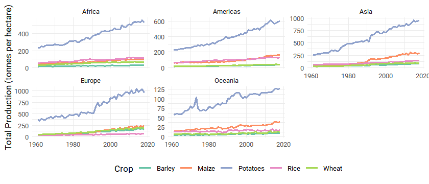

Key Crop Yields
================

Let’s look at key crop yields, and see if we can build some models
around the data.

``` r
key_crop_yields <- readr::read_csv('https://raw.githubusercontent.com/rfordatascience/tidytuesday/master/data/2020/2020-09-01/key_crop_yields.csv')
fertilizer <- readr::read_csv('https://raw.githubusercontent.com/rfordatascience/tidytuesday/master/data/2020/2020-09-01/cereal_crop_yield_vs_fertilizer_application.csv')
tractors <- readr::read_csv('https://raw.githubusercontent.com/rfordatascience/tidytuesday/master/data/2020/2020-09-01/cereal_yields_vs_tractor_inputs_in_agriculture.csv')
land_use <- readr::read_csv('https://raw.githubusercontent.com/rfordatascience/tidytuesday/master/data/2020/2020-09-01/land_use_vs_yield_change_in_cereal_production.csv')
arable_land <- readr::read_csv('https://raw.githubusercontent.com/rfordatascience/tidytuesday/master/data/2020/2020-09-01/arable_land_pin.csv')
```

Let’s look at production over time of our key crops:

``` r
key_crops <- c("Potatoes", "Banans", "Maize", "Rice", "Wheat", "Barley")

key_crop_yields %>%
  pivot_longer(ends_with("per hectare)"),
    names_to = "Crop",
    values_to = "Amount"
  ) %>%
  mutate(Crop = str_replace(Crop, coll(" (tonnes per hectare)"), "")) %>%
  group_by(Crop, Year) %>%
  summarise(TotalProduction = sum(Amount, na.rm = T)) %>%
  filter(!is.na(TotalProduction) & Crop %in% key_crops) %>%
  ggplot(aes(x = Year, y = TotalProduction, colour = Crop)) +
  geom_line(size = 1) +
  scale_color_brewer(type = 'qual', palette = 'Set2') +
  labs(
    x = NULL,
    y = "Production (tonnes per hectare)"
  ) +
  theme(
    legend.position = "none"
  ) +
  facet_wrap(~Crop, scales = "free_y")
```

<!-- --> Let’s take a
look now by continent:

``` r
library(countrycode)

country_to_continent <- key_crop_yields %>%
  distinct(Entity) %>%
  mutate(Continent = countrycode(
    sourcevar = Entity, origin = "country.name",
    destination = "continent"
  )) %>%
  filter(!is.na(Continent))


key_crop_yields %>%
  inner_join(country_to_continent) %>%
  pivot_longer(ends_with("per hectare)"),
    names_to = "Crop",
    values_to = "Amount"
  ) %>%
  mutate(Crop = str_replace(Crop, coll(" (tonnes per hectare)"), "")) %>%
  filter(Crop %in% key_crops) %>%
  group_by(Year, Continent, Crop) %>%
  summarise(Total_Production = sum(Amount, na.rm = T)) %>%
  ggplot(aes(x = Year, y = Total_Production, colour = Crop)) +
  geom_line(size = 1) +
  facet_wrap(~Continent, scales = "free_y") +
  scale_color_brewer(type = 'qual', palette = 'Set2') +
  theme(legend.position = 'bottom') +
  labs(
    x = NULL,
    y = "Total Production (tonnes per hectare)"
  )
```

<!-- -->

## So, what impacts production of potatoes?

``` r
potato_data <- key_crop_yields %>%
  inner_join(country_to_continent) %>%
  transmute(
    Entity,
    Year,
    Continent,
    Potatoes = `Potatoes (tonnes per hectare)`
  )


arable_land <- arable_land %>%
  transmute(Entity, Year, ArableLand = `Arable land needed to produce a fixed quantity of crops ((1.0 = 1961))`)

fertilizer_use <- fertilizer %>%
  transmute(Entity, Year, FertilizerUse = `Nitrogen fertilizer use (kilograms per hectare)`) 

tractor_use_pop <- tractors %>%
  transmute(Entity, Year = as.integer(Year),
            TractorsPer100SqKm = `Tractors per 100 sq km arable land`,
            Population = `Total population (Gapminder)`)


potato_full_data <- potato_data %>%
  inner_join(arable_land) %>%
  inner_join(fertilizer_use) %>%
  inner_join(tractor_use_pop) %>%
  mutate(across(where(is.numeric), replace_na, replace=0))
```

Linear regression time

``` r
library(tidymodels)

potato_recp <- recipe(Potatoes ~ ., data = potato_full_data) %>%
  update_role(Entity, new_role="id") %>%
  step_dummy(Continent) %>%
  step_normalize(all_predictors()) %>%
  step_zv(all_predictors()) 

potato_prep <- prep(potato_recp)

potato_prep
```

    ## Data Recipe
    ## 
    ## Inputs:
    ## 
    ##       role #variables
    ##         id          1
    ##    outcome          1
    ##  predictor          6
    ## 
    ## Training data contained 8120 data points and no missing data.
    ## 
    ## Operations:
    ## 
    ## Dummy variables from Continent [trained]
    ## Centering and scaling for Year, ArableLand, ... [trained]
    ## Zero variance filter removed no terms [trained]

``` r
potato_wf <- workflow() %>%
  add_recipe(potato_recp) %>%
  add_model(linear_reg() %>% set_engine('lm'))

potato_wf
```

    ## == Workflow ====================================================================================
    ## Preprocessor: Recipe
    ## Model: linear_reg()
    ## 
    ## -- Preprocessor --------------------------------------------------------------------------------
    ## 3 Recipe Steps
    ## 
    ## * step_dummy()
    ## * step_normalize()
    ## * step_zv()
    ## 
    ## -- Model ---------------------------------------------------------------------------------------
    ## Linear Regression Model Specification (regression)
    ## 
    ## Computational engine: lm

``` r
potato_fit <- potato_wf %>%
  fit(data = potato_full_data)

potato_fit %>%
  pull_workflow_fit() %>%
  tidy() %>%
  mutate(across(where(is.numeric), round, digits=3)) %>%
  arrange(-estimate) %>%
  knitr::kable()
```

| term                | estimate | std.error | statistic | p.value |
| :------------------ | -------: | --------: | --------: | ------: |
| (Intercept)         |   11.404 |     0.089 |   127.460 |       0 |
| Continent\_Europe   |    4.052 |     0.116 |    34.899 |       0 |
| TractorsPer100SqKm  |    2.360 |     0.104 |    22.786 |       0 |
| Continent\_Asia     |    2.184 |     0.107 |    20.452 |       0 |
| Year                |    2.038 |     0.098 |    20.751 |       0 |
| FertilizerUse       |    1.758 |     0.101 |    17.323 |       0 |
| Continent\_Americas |    0.854 |     0.104 |     8.197 |       0 |
| Population          |    0.527 |     0.094 |     5.611 |       0 |
| Continent\_Oceania  |    0.357 |     0.095 |     3.758 |       0 |
| ArableLand          |  \-0.522 |     0.090 |   \-5.812 |       0 |

How are our residuals?

``` r
actual_fit <- potato_fit %>%
  pull_workflow_fit()

augment(actual_fit$fit) %>%
  ggplot(aes(.resid)) +
  geom_histogram(binwidth=5) +
  geom_vline(aes(xintercept=0)) +
  xlim(-40, 40) +
  labs(
    x = 'Fitted Residuals',
    y = NULL, 
    title = 'Residuals plot',
    subtitle = 'Reasonably normally distributed'
  )
```

<!-- -->
